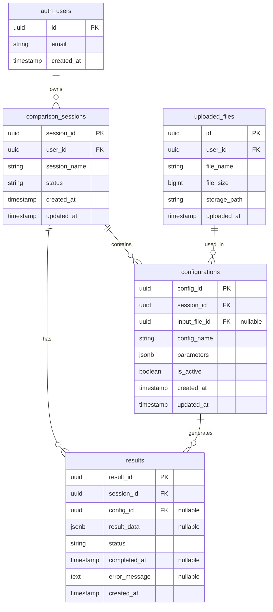

# SlicerCompare Database Schema

**Version:** 1.0.0
**Last Updated:** 2024-10-31
**Story:** Story 1.4 - Configuration Data Model

## Overview

The SlicerCompare database schema is designed to support comparison of 3D printer slicer configurations and their results. The schema uses PostgreSQL with Row-Level Security (RLS) for multi-tenant data isolation.

## Entity Relationship Diagram



## Tables

### comparison_sessions

User comparison projects/sessions for storing slicer configuration comparisons.

**Purpose:** Represents a comparison project where a user compares 2-3 different slicer configurations for the same 3D model.

| Column | Type | Constraints | Description |
|--------|------|-------------|-------------|
| `session_id` | UUID | PRIMARY KEY, DEFAULT gen_random_uuid() | Unique identifier for the comparison session |
| `user_id` | UUID | NOT NULL, FK → auth.users(id) ON DELETE CASCADE | Reference to the user who owns this session |
| `session_name` | VARCHAR(255) | NULL | Optional user-provided name for the session |
| `status` | VARCHAR(50) | NOT NULL, DEFAULT 'active', CHECK | Session lifecycle status: `active`, `completed`, or `archived` |
| `created_at` | TIMESTAMPTZ | NOT NULL, DEFAULT NOW() | Timestamp when the session was created |
| `updated_at` | TIMESTAMPTZ | NOT NULL, DEFAULT NOW() | Timestamp when the session was last modified (auto-updated) |

**Indexes:**
- `idx_sessions_user_id` on `(user_id)` - Fast lookup of user's sessions
- `idx_sessions_status` on `(status)` - Fast filtering by status
- `idx_sessions_created_at` on `(created_at DESC)` - Fast chronological sorting
- `idx_sessions_user_status` on `(user_id, status)` - Compound index for common query pattern

**Triggers:**
- `update_comparison_sessions_updated_at` - Automatically updates `updated_at` on row modification

**Status Lifecycle:**
```
active → completed → archived
```

---

### configurations

Slicer configurations to compare within sessions (maximum 3 active per session).

**Purpose:** Stores different slicer parameter sets that will be used to slice the same 3D model. Each configuration represents a different approach (e.g., fast vs quality, different support types).

| Column | Type | Constraints | Description |
|--------|------|-------------|-------------|
| `config_id` | UUID | PRIMARY KEY, DEFAULT gen_random_uuid() | Unique identifier for the configuration |
| `session_id` | UUID | NOT NULL, FK → comparison_sessions(session_id) ON DELETE CASCADE | Reference to the parent comparison session |
| `input_file_id` | UUID | FK → uploaded_files(id) ON DELETE SET NULL | Reference to the uploaded STL/3MF file (nullable if file deleted) |
| `config_name` | VARCHAR(255) | NOT NULL | User-provided name for this configuration (e.g., "Fast Print", "High Quality") |
| `parameters` | JSONB | NOT NULL, CHECK (jsonb_typeof = 'object') | JSONB object containing slicer parameters |
| `is_active` | BOOLEAN | NOT NULL, DEFAULT true | Whether this configuration is active (max 3 active per session enforced by trigger) |
| `created_at` | TIMESTAMPTZ | NOT NULL, DEFAULT NOW() | Timestamp when the configuration was created |
| `updated_at` | TIMESTAMPTZ | NOT NULL, DEFAULT NOW() | Timestamp when the configuration was last modified (auto-updated) |

**Indexes:**
- `idx_configs_session_id` on `(session_id)` - Fast lookup of session's configurations
- `idx_configs_input_file_id` on `(input_file_id)` WHERE `input_file_id IS NOT NULL` - Partial index for file references
- `idx_configs_parameters` GIN index on `(parameters)` - Fast JSONB searches

**Constraints:**
- Maximum 3 active configurations per session (enforced by `check_max_active_configs()` trigger)
- `parameters` must be a JSON object, not array or primitive

**Triggers:**
- `enforce_max_active_configs` - Prevents more than 3 active configurations per session
- `update_configurations_updated_at` - Automatically updates `updated_at` on row modification

**Parameters Schema:**

The `parameters` JSONB field follows the schema defined in `schema/config-parameters.schema.json`:

```json
{
  "layer_height": 0.2,        // mm (required, 0.05-0.4)
  "infill_density": 20,        // % (required, 0-100)
  "support_type": "tree",      // enum (required: none, normal, tree)
  "printer_model": "X1_Carbon", // enum (required: X1_Carbon, P1P, P1S, A1_Mini)
  "print_speed": 100,          // mm/s (optional, 50-500)
  "nozzle_temperature": 220,   // °C (optional, 180-300)
  "bed_temperature": 60,       // °C (optional, 0-120)
  "wall_thickness": 1.2,       // mm (optional, 0.4-10.0)
  "top_bottom_thickness": 0.8  // mm (optional, 0.2-5.0)
}
```

---

### results

Slicing operation results and extracted metrics from G-code files.

**Purpose:** Stores the output of slicing operations, including metrics parsed from generated G-code files (print time, filament usage, etc.).

| Column | Type | Constraints | Description |
|--------|------|-------------|-------------|
| `result_id` | UUID | PRIMARY KEY, DEFAULT gen_random_uuid() | Unique identifier for the result |
| `session_id` | UUID | NOT NULL, FK → comparison_sessions(session_id) ON DELETE CASCADE | Reference to the parent comparison session |
| `config_id` | UUID | FK → configurations(config_id) ON DELETE SET NULL | Reference to the configuration that generated this result (nullable if config deleted) |
| `result_data` | JSONB | NULL, CHECK (jsonb_typeof = 'object' OR NULL) | JSONB object containing parsed metrics |
| `status` | VARCHAR(50) | NOT NULL, DEFAULT 'pending', CHECK | Result processing status: `pending`, `processing`, `completed`, or `failed` |
| `completed_at` | TIMESTAMPTZ | NULL, CHECK (completed results have timestamp) | Timestamp when slicing and parsing completed successfully |
| `error_message` | TEXT | NULL, CHECK (failed results have error message) | Error message if slicing or parsing failed |
| `created_at` | TIMESTAMPTZ | NOT NULL, DEFAULT NOW() | Timestamp when the result record was created |

**Indexes:**
- `idx_results_session_id` on `(session_id)` - Fast lookup of session's results
- `idx_results_config_id` on `(config_id)` WHERE `config_id IS NOT NULL` - Partial index for config references
- `idx_results_status` on `(status)` - Fast filtering by status
- `idx_results_session_status` on `(session_id, status)` - Compound index for common query pattern
- `idx_results_data` GIN index on `(result_data)` - Fast JSONB searches

**Constraints:**
- Completed results must have `completed_at` timestamp
- Failed results must have `error_message`
- `result_data` must be a JSON object when not null

**Triggers:**
- `manage_result_completed_at` - Automatically sets/clears `completed_at` based on status changes

**Result Data Schema:**

The `result_data` JSONB field follows the schema defined in `schema/result-data.schema.json`:

```json
{
  "print_time_seconds": 3600,         // seconds (required)
  "filament_usage_grams": 12.5,       // grams (required)
  "filament_usage_mm": 4567.89,       // mm (optional)
  "support_material_grams": 2.5,      // grams (optional, 0 if no supports)
  "layer_count": 200,                 // count (required)
  "gcode_file_path": "path/to/file",  // string (required, Supabase Storage path)
  "parsed_at": "2024-10-31T14:30:00Z", // ISO 8601 (optional)
  "model_height_mm": 50.0,            // mm (optional)
  "estimated_cost": 1.25              // currency (optional)
}
```

**Status Lifecycle:**
```
pending → processing → completed
                    ↘ failed
```

---

### uploaded_files (from Story 1.2)

Uploaded STL/3MF files stored in Supabase Storage.

**Purpose:** Stores metadata for uploaded 3D model files. Files are stored in Supabase Storage, this table tracks metadata.

| Column | Type | Description |
|--------|------|-------------|
| `id` | UUID | Unique identifier for the uploaded file |
| `user_id` | UUID | Reference to the user who uploaded the file |
| `file_name` | TEXT | Original filename |
| `file_size` | BIGINT | File size in bytes |
| `storage_path` | TEXT | Path in Supabase Storage bucket |
| `uploaded_at` | TIMESTAMPTZ | Timestamp when file was uploaded |

## Foreign Key Relationships

### Cascade Behavior Summary

| Relationship | Parent Delete | Behavior | Rationale |
|--------------|---------------|----------|-----------|
| `comparison_sessions.user_id` → `auth.users(id)` | User deleted | CASCADE | Remove all user data |
| `configurations.session_id` → `comparison_sessions(session_id)` | Session deleted | CASCADE | Configurations belong to session |
| `results.session_id` → `comparison_sessions(session_id)` | Session deleted | CASCADE | Results belong to session |
| `configurations.input_file_id` → `uploaded_files(id)` | File deleted | SET NULL | Preserve config even if source file gone |
| `results.config_id` → `configurations(config_id)` | Config deleted | SET NULL | Preserve historical results |

### Detailed Relationships

1. **auth.users → comparison_sessions (CASCADE)**
   - When a user is deleted, all their comparison sessions are permanently deleted
   - This cascades to all configurations and results in those sessions

2. **comparison_sessions → configurations (CASCADE)**
   - When a session is deleted, all configurations in that session are deleted
   - This sets `config_id` to NULL in related results (due to SET NULL on results)

3. **comparison_sessions → results (CASCADE)**
   - When a session is deleted, all results in that session are deleted
   - This removes all slicing operation data for the session

4. **uploaded_files → configurations (SET NULL)**
   - When a file is deleted, `input_file_id` in configurations is set to NULL
   - The configuration record is preserved with parameters intact
   - Allows user to re-upload file or proceed without file reference

5. **configurations → results (SET NULL)**
   - When a configuration is deleted, `config_id` in results is set to NULL
   - Historical result data is preserved for analysis
   - User can still view past comparison results even if config deleted

## Row-Level Security (RLS)

All tables have RLS enabled with policies enforcing multi-tenant data isolation.

### Policy Pattern

Each table has four policies for CRUD operations:

| Operation | Policy Name Pattern | Logic |
|-----------|-------------------|-------|
| SELECT | `Users can view {resource} in own sessions` | `auth.uid() = user_id` or session ownership check |
| INSERT | `Users can create {resource} in own sessions` | `auth.uid() = user_id` or session ownership check |
| UPDATE | `Users can update {resource} in own sessions` | `auth.uid() = user_id` or session ownership check |
| DELETE | `Users can delete {resource} in own sessions` | `auth.uid() = user_id` or session ownership check |

### Direct vs Transitive Ownership

**comparison_sessions:**
- Direct ownership: `auth.uid() = user_id`

**configurations and results:**
- Transitive ownership through session:
  ```sql
  session_id IN (
    SELECT session_id FROM comparison_sessions
    WHERE user_id = auth.uid()
  )
  ```

This ensures users can only access configurations and results in sessions they own, even if `config_id` or `result_id` is known.

## Common Query Patterns

### List all sessions for current user

```sql
SELECT * FROM comparison_sessions
WHERE user_id = auth.uid()
ORDER BY created_at DESC;
```

**TypeScript (Supabase client):**
```typescript
const { data: sessions, error } = await supabase
  .from('comparison_sessions')
  .select('*')
  .order('created_at', { ascending: false });
```

---

### Get session with all configurations and results

```sql
SELECT
  s.*,
  json_agg(DISTINCT c.*) FILTER (WHERE c.config_id IS NOT NULL) as configurations,
  json_agg(DISTINCT r.*) FILTER (WHERE r.result_id IS NOT NULL) as results
FROM comparison_sessions s
LEFT JOIN configurations c ON s.session_id = c.session_id
LEFT JOIN results r ON s.session_id = r.session_id
WHERE s.session_id = $1
GROUP BY s.session_id;
```

**TypeScript (Supabase client with nested relations):**
```typescript
const { data: session, error } = await supabase
  .from('comparison_sessions')
  .select(`
    *,
    configurations (
      *,
      uploaded_files (
        id,
        file_name,
        file_size
      )
    ),
    results (*)
  `)
  .eq('session_id', sessionId)
  .single();
```

---

### Create new configuration

```typescript
const { data: config, error } = await supabase
  .from('configurations')
  .insert({
    session_id: sessionId,
    input_file_id: fileId, // or null
    config_name: 'Fast Print',
    parameters: {
      layer_height: 0.28,
      infill_density: 15,
      support_type: 'tree',
      printer_model: 'X1_Carbon',
      print_speed: 150
    },
    is_active: true
  })
  .select()
  .single();
```

---

### Update result status after slicing completes

```typescript
const { data: result, error } = await supabase
  .from('results')
  .update({
    status: 'completed',
    result_data: {
      print_time_seconds: 3600,
      filament_usage_grams: 12.5,
      filament_usage_mm: 4567.89,
      support_material_grams: 0,
      layer_count: 200,
      gcode_file_path: 'generated-gcode/session-uuid/config-uuid.gcode',
      parsed_at: new Date().toISOString()
    }
    // completed_at is set automatically by trigger
  })
  .eq('result_id', resultId)
  .select()
  .single();
```

---

### Get all pending results for batch processing

```typescript
const { data: pendingResults, error } = await supabase
  .from('results')
  .select(`
    *,
    configurations (
      *,
      uploaded_files (*)
    )
  `)
  .eq('status', 'pending')
  .order('created_at', { ascending: true });
```

---

### Search configurations by parameter value

```sql
SELECT * FROM configurations
WHERE parameters @> '{"layer_height": 0.2}'::jsonb;
```

**TypeScript:**
```typescript
const { data: configs, error } = await supabase
  .from('configurations')
  .select('*')
  .contains('parameters', { layer_height: 0.2 });
```

---

### Get comparison results with file info

```typescript
const { data: comparison, error } = await supabase
  .from('comparison_sessions')
  .select(`
    session_name,
    status,
    configurations!inner (
      config_name,
      parameters,
      results (
        status,
        result_data,
        completed_at
      )
    )
  `)
  .eq('session_id', sessionId)
  .single();
```

## Database Setup Instructions

### Prerequisites

- PostgreSQL 14+ with Supabase extensions
- Supabase CLI installed (`npm install -g supabase`)

### Local Development Setup

1. **Initialize Supabase project:**
   ```bash
   cd C:\Users\dpmal\projects\slicercompare
   supabase init
   ```

2. **Start local Supabase:**
   ```bash
   supabase start
   ```

3. **Apply migrations:**
   ```bash
   supabase db reset
   ```
   This will apply all migrations in `supabase/migrations/` in order.

4. **Seed test data (optional):**
   ```bash
   psql -h localhost -p 54322 -U postgres -d postgres -f supabase/seed.sql
   ```

   **Note:** You must create a test user through Supabase Auth UI first, then update the `test_user_id` in `seed.sql` with your actual user UUID.

5. **Verify tables created:**
   - Open Supabase Studio: http://localhost:54323
   - Navigate to Table Editor
   - Verify tables: `comparison_sessions`, `configurations`, `results`

### Production Deployment

1. **Link to Supabase project:**
   ```bash
   supabase link --project-ref your-project-ref
   ```

2. **Push migrations to production:**
   ```bash
   supabase db push
   ```

3. **Verify migration status:**
   ```bash
   supabase migration list
   ```

## Migration Files

| File | Description | Status |
|------|-------------|--------|
| `20241031000000_uploaded_files.sql` | Story 1.2 - Uploaded files table | ✅ Applied |
| `20241031120000_comparison_sessions.sql` | Story 1.4 - Comparison sessions table | 🆕 New |
| `20241031120001_configurations.sql` | Story 1.4 - Configurations table | 🆕 New |
| `20241031120002_results.sql` | Story 1.4 - Results table | 🆕 New |

## Schema Evolution

### Adding New Parameters

To add new parameters to the `parameters` JSONB field:

1. Update `schema/config-parameters.schema.json` with new field
2. No database migration required (JSONB is flexible)
3. Update application validation logic
4. Update documentation

Example:
```json
{
  "retraction_distance": {
    "type": "number",
    "minimum": 0,
    "maximum": 10,
    "description": "Retraction distance in mm"
  }
}
```

### Adding New Result Metrics

Similar process for `result_data` JSONB field:

1. Update `schema/result-data.schema.json`
2. Update G-code parser to extract new metric
3. No database migration needed

## Performance Considerations

### Index Usage

All foreign keys and frequently queried columns are indexed:
- User lookups: `idx_sessions_user_id`, `idx_sessions_user_status`
- Status filtering: `idx_sessions_status`, `idx_results_status`
- JSONB searches: GIN indexes on `parameters` and `result_data`

### Query Optimization Tips

1. **Always filter by session_id when possible:**
   ```typescript
   // Good
   .eq('session_id', sessionId)
   .select('*')

   // Avoid
   .select('*')  // Full table scan
   ```

2. **Use nested selects instead of multiple queries:**
   ```typescript
   // Good - one query
   .select('*, configurations(*), results(*)')

   // Avoid - three queries
   const session = await supabase.from('comparison_sessions').select('*');
   const configs = await supabase.from('configurations').select('*');
   const results = await supabase.from('results').select('*');
   ```

3. **Limit result sets:**
   ```typescript
   .select('*')
   .limit(50)
   .order('created_at', { ascending: false })
   ```

### Expected Performance

| Operation | Expected Time | Notes |
|-----------|--------------|-------|
| Query sessions by user | <50ms | With index |
| Query configurations for session | <30ms | With index |
| Query results for session | <50ms | With index |
| JSONB parameter search | <100ms | GIN index, <1000 rows |
| Session deletion (cascade) | <200ms | Includes configs + results |

## Troubleshooting

### RLS Policy Issues

**Problem:** Query returns empty result despite data existing

**Solution:** Verify RLS policies allow access:
```sql
-- Check current user
SELECT auth.uid();

-- Check session ownership
SELECT * FROM comparison_sessions WHERE user_id = auth.uid();

-- Disable RLS temporarily for debugging (local only!)
ALTER TABLE comparison_sessions DISABLE ROW LEVEL SECURITY;
```

### Max Active Configurations Error

**Problem:** "Maximum of 3 active configurations per session exceeded"

**Solution:** Deactivate an existing configuration first:
```typescript
await supabase
  .from('configurations')
  .update({ is_active: false })
  .eq('config_id', configIdToDeactivate);
```

### Migration Conflicts

**Problem:** Migration fails due to existing table

**Solution:** Reset local database:
```bash
supabase db reset
```

For production, create a new migration to alter existing table.

## References

- **Story:** [Story 1.4 - Configuration Data Model](stories/story-1-4-2025-10-31.md)
- **JSON Schemas:** `schema/config-parameters.schema.json`, `schema/result-data.schema.json`
- **Architecture:** [Decision Architecture](architecture.md)
- **Supabase Docs:** https://supabase.com/docs/guides/database
- **PostgreSQL JSONB:** https://www.postgresql.org/docs/current/datatype-json.html

## Change Log

| Date | Version | Changes | Author |
|------|---------|---------|--------|
| 2024-10-31 | 1.0.0 | Initial database schema documentation | Dee |
